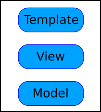
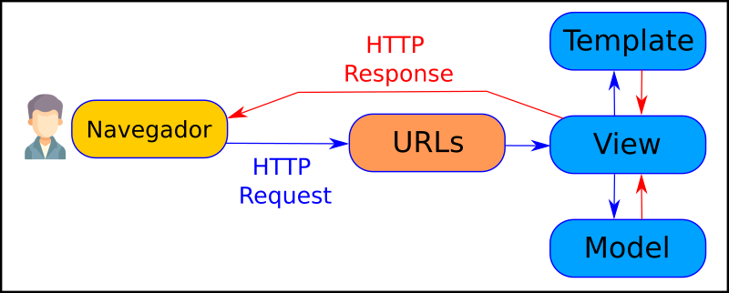
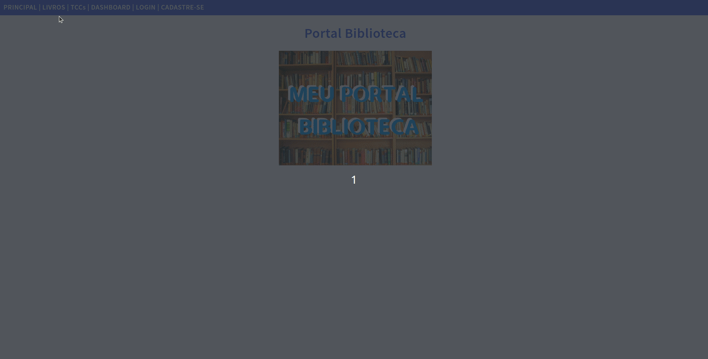

# Aula Django 02 - Sistema para Portal Biblioteca

<p align="center">
  <a href="#">
    
  </a>
  <a href="#">
    
  </a>
  <a href="#">
    
  </a>
</p>

## Índice

* [Introdução](#introdução)
* [Recursos Utilizados](#recursos-utilizados)
* [Fundamentos Teóricos](#fundamentos-teóricos)
* [Objetivo da Aula](#objetivo-da-aula)
* [Desenvolvimento do Projeto](#desenvolvimento-do-projeto)
* [Créditos e Referências](#créditos-e-referências)

## Introdução

<a href="#índice"></a>

O objetivo deste tutorial é criar um sistema para gestão de biblioteca usando o framework Python Django. Esse projeto será utilizado na disciplina GAC116 - Programação Web da Universidade Federal de Lavras (UFLA).

Este tutorial foi elaborado com base no tutorial disponível no [curso de Django da W3Schools](https://www.w3schools.com/django/index.php) e na [documentação oficial do Django](https://docs.djangoproject.com/pt-br/5.0/).

A aula está organizada no formato de tutorial, permitindo que cada estudante replique em seu computador os conceitos e recursos apresentados. O código será desenvolvido gradualmente, de modo a evidenciar a evolução da solução e facilitar a compreensão de como as tecnologias Django, HTML, CSS e JavaScript se integram na construção de aplicações web.

## Recursos Utilizados

<a href="#índice"></a>

A seguir estão listados os principais recursos empregados no desenvolvimento desta aula.

### Linguagens

* Python - Linguagem de programação principal
  * [Link do site Python](https://www.python.org/)
  * [Link do curso da W3Schools](https://www.w3schools.com/python/default.asp)
* HTML - Responsável pela estrutura da página web
  * [Link do curso da W3Schools](https://www.w3schools.com/html/default.asp)
* CSS - Responsável pela apresentação da página web
  * [Link do curso da W3Schools](https://www.w3schools.com/css/default.asp)
* JavaScript - Responsável pelo comportamento da página web
  * [Link do curso da W3Schools](https://www.w3schools.com/js/default.asp)
* SQL - Linguagem para consultas no banco de dados
  * [Link do curso da W3Schools](https://www.w3schools.com/sql/default.asp)

### Frameworks

* Django - Framework web
  * [Link do site do Django](https://www.djangoproject.com/)
  * [Link do curso da w3schools](https://www.w3schools.com/django/index.php)

### Bibliotecas

* Jinja - Biblioteca Python para templates
    * [Link do site do Jinja](https://jinja.palletsprojects.com/en/3.1.x/)
* Chart.js - Biblioteca JavaScript para gráficos
    * [Link do site do chart.js](https://www.chartjs.org/)

### Ferramentas

* Visual Studio Code - Ambiente de desenvolvimento integrado - [link](https://code.visualstudio.com/)
* Git - Sistema de controle de versão - [link](https://git-scm.com/)
* Github - Plataforma de hospedagem e colaboração em projetos de software - [link](https://github.com/)
* Pip - Gerenciador de pacotes do Python - [link](https://pypi.org/project/pip/)
* Venv - Ambiente virtual do Python - [link](https://docs.python.org/pt-br/3/library/venv.html)
* SQLite Online - SGBD - [link](https://sqliteonline.com/)
* DB Browser for SQLite - SGBD - [link](https://sqlitebrowser.org/)

## Fundamentos Teóricos

<a href="#índice"></a>

A seguir estão destacados alguns dos principais fundamentos teóricos para entendimento deste tutorial.

### Características do Django

**1. Framework completo:** Django oferece tudo o que é necessário para o desenvolvimento de uma aplicação web, incluindo roteamento de URLs, Mapeamento Objeto-Relacional (ORM), sistema de templates, autenticação, etc.

**2. Administração automática:** Com base nos modelos definidos, Django gera automaticamente uma interface administrativa poderosa e personalizável, economizando tempo no desenvolvimento de funcionalidades administrativas.

**3. ORM (*Object-Relational Mapping*):** O Django possui um ORM que facilita a interação com bancos de dados relacionais, permitindo que os desenvolvedores escrevam consultas em Python ao invés de SQL.

**4. Sistema de templates:** Django possui um sistema de templates eficiente que permite criar HTML dinâmico de forma organizada, utilizando lógica básica como laços e condicionais.

**5. Segurança embutida:** O Django se preocupa com a segurança, oferecendo proteção contra ataques comuns como SQL *Injection*, *Cross-site Scripting* (XSS), *Cross-site Request Forgery* (CSRF), e *Clickjacking*.

**6. Escalabilidade:** Django é altamente escalável, podendo lidar com grandes volumes de tráfego, como em sites populares que utilizam o framework (por exemplo, Instagram e Pinterest).

**7. Comunidade ativa e documentação:** Django conta com uma ampla comunidade de desenvolvedores e uma documentação completa e detalhada, facilitando a resolução de problemas e o aprendizado.

**8. Reutilização de código:** Django promove a reutilização de componentes por meio de pacotes chamados "apps". Cada app é modular e pode ser usado em diferentes projetos ou em diferentes partes da mesma aplicação.

**9. Suporte a várias bases de dados:** O Django suporta diferentes sistemas de banco de dados, como PostgreSQL, MySQL, SQLite e Oracle, tornando-o flexível para diversos ambientes.

**10. Testes integrados:** O Django tem suporte nativo para testes automatizados, permitindo que desenvolvedores escrevam e executem testes facilmente para garantir a qualidade do código.

### Arquitetura Web de Três Camadas

A arquitetura web de três camadas é um padrão de design de software que organiza uma aplicação em três níveis distintos, cada um com responsabilidades bem definidas. Essas camadas são:

**1. Camada de Apresentação (Frontend)**:

* Também chamada de interface de usuário, essa camada é responsável pela interação com o usuário. Ela inclui tudo o que o usuário vê e utiliza para interagir com o sistema, como páginas web, formulários, botões, e elementos visuais em geral.
* Aqui, são usados tecnologias como HTML, CSS, JavaScript e frameworks frontend (React, Angular, etc.).
* A camada de apresentação envia as entradas dos usuários para a camada de negócios e exibe os resultados de volta para o usuário.

**2. Camada de Negócios (Lógica da Aplicação - Backend)**:

* Nessa camada está a lógica de negócios da aplicação, ou seja, as regras que governam como os dados devem ser processados e as operações que devem ser realizadas. Ela trata os pedidos recebidos da camada de apresentação e executa as operações necessárias.
* Essa camada pode incluir validações, cálculos e chamadas ao banco de dados. Em termos de tecnologia, é geralmente desenvolvida com linguagens de programação como Python, Java, PHP, ou frameworks como Django, Spring Boot, Laravel, etc.

**3. Camada de Dados (Banco de Dados - Backend)**:

* A camada de dados gerencia o armazenamento e recuperação de dados em um banco de dados. Ela é responsável pela persistência dos dados e operações como criar, ler, atualizar e deletar (CRUD).
* Geralmente, são usados sistemas de gerenciamento de banco de dados relacionais (como MySQL, PostgreSQL) ou não relacionais (como MongoDB).
* A camada de negócios interage com essa camada para armazenar e buscar dados conforme necessário.

**Fluxo da Arquitetura de Três Camadas**:

* O usuário interage com a Camada de Apresentação.
* A Camada de Apresentação faz requisições para a Camada de Negócios.
* A Camada de Negócios processa a lógica e, se necessário, interage com a Camada de Dados.
* A Camada de Dados responde com os dados necessários para a Camada de Negócios.
* A Camada de Negócios retorna os resultados processados para a Camada de Apresentação.
* A Camada de Apresentação exibe os resultados para o usuário.

Essa separação facilita a manutenção e escalabilidade da aplicação, permitindo que cada camada possa ser modificada ou melhorada de forma independente.


### Arquitetura MVT do Django

O modelo MVT (*Model-View-Template*) é uma arquitetura usada no framework Django para desenvolvimento de aplicações web. Ele organiza a aplicação em três componentes principais:

* **Model (Modelo)**: Responsável pela definição da estrutura dos dados e a interação com o banco de dados. Ele define as classes que representam as tabelas e seus relacionamentos, além de métodos para realizar consultas e operações nos dados.

* **View (Visão)**: Contém a lógica da aplicação. A view recebe as requisições dos usuários, processa os dados (geralmente acessando o Model), e retorna uma resposta, como uma página HTML renderizada ou dados em formato JSON.

* **Template (Apresentação)**: É a camada de apresentação, onde o conteúdo dinâmico gerado pela View é inserido em arquivos HTML. Os templates permitem a separação da lógica de negócio da interface de usuário, tornando o código mais organizado.

Diferente do padrão MVC, onde o controller gerencia a lógica de controle, no Django, a função das views cumpre esse papel, enquanto os templates gerenciam a apresentação.

A figura abaixo detalha os componentes descritos acima.



No modelo MVT do Django, as requisições seguem um fluxo bem definido, onde cada componente (Model, View, Template) desempenha um papel específico no processamento e resposta de uma requisição HTTP. O fluxo funciona da seguinte forma:

* **Recebimento da Requisição (HTTP Request)**: Quando um usuário acessa uma URL no navegador, o Django recebe a requisição HTTP correspondente. Esse processo começa no URL *dispatcher* (mapeador de URLs), que verifica qual view deve ser chamada com base na URL requisitada.

* **View (Visão)**: A View é o ponto de entrada para o processamento da requisição. A função ou classe associada à URL recebida é executada. Ela é responsável por: Receber a requisição do usuário; Executar a lógica necessária, que pode incluir validações, processamento de dados, ou interações com o banco de dados através dos Models; e Retornar uma resposta apropriada.

* **Model (Modelo)**: Se a View precisar acessar ou manipular dados, ela fará isso por meio do Model. O Model contém a lógica de negócios relacionada à persistência de dados, permitindo a View realizar operações como criar, ler, atualizar ou deletar registros no banco de dados.

* **Template (Apresentação)**: Após processar os dados, a View geralmente prepara um contexto (um dicionário de dados) e passa esse contexto para o Template. O Template é um arquivo HTML com marcações especiais do Django que permitem a inserção de dados dinâmicos. O Template renderiza esses dados em uma estrutura HTML, exibindo o conteúdo adequado com base nas informações passadas pela View.

* **Resposta (HTTP Response)**: Depois que o Template é renderizado, a View retorna uma resposta HTTP (normalmente uma página HTML ou dados JSON em APIs) ao navegador ou cliente. Essa resposta contém o conteúdo processado e visualizado pelo usuário.

A figura abaixo detalha o fluxo descrito acima.



A figura abaixo detalha ainda mais a arquitetura MVT e as tecnologias envolvidas.


### Modelo ORM

O Django suporta o conceito de Mapeamento Objeto-Relacional (ORM). Através do ORM você define a modelagem de dados através de classes em Python. Com isso é possível gerar suas tabelas no banco de dados e manipulá-las sem necessidade de utilizar SQL (o que também é possível). Os registros de cada tabela são representados como instâncias das classes correspondentes.

## Objetivo da Aula

<a href="#índice"></a>

O objetivo desta aula é iniciar a construção de um projeto de um portal de biblioteca usando o framework Python Django. Aprenderemos a configurar o Django, a criar views e templates, a incluir código CSS e JavaScript ao projeto, além de trabalhar com template mestre para evitar repetição de código HTML.

A animação abaixo mostra de forma visual o resultado esperado nesta aula.



## Desenvolvimento do Projeto

<a href="#índice"></a>

Siga os passos abaixo para alcançar o objetivo da aula.

### Clonar o Repositório

Para iniciar, faça o clone do repositório com o seguinte comando:

```bash
git clone https://github.com/ufla-prog-web/aula-django-02.git
```

### Baixar o Repositório

Como alternativa ao clone, você pode baixar diretamente o repositório acessando este [link](https://github.com/ufla-prog-web/aula-django-02). Clique em `Code` e, em seguida, em `Download ZIP`.

### Abrir o Visual Studio Code

Abra o Visual Studio Code (VS Code) na pasta `aula-django-02`.

**Dica:** abra o arquivo `README.md` e selecione a opção `Open Preview to the Side` para visualizar o tutorial lado a lado enquanto desenvolve a aplicação.

**Dica:** abra um terminal utilizando a IDE clicando em `Terminal` e `New Terminal`.

### Criar a Pasta do Projeto

Em seguida, crie, dentro da pasta `aula-django-02`, a pasta do projeto denominada `code`:

```bash
cd aula-django-02/
mkdir code
cd code/
```

### Criar o Ambiente Virtual

Crie um ambiente virtual para isolar as dependências do projeto:

```bash
python3 -m venv venv
```

**Observação:** no exemplo acima, o segundo nome `venv` é o nome que escolhemos para o nosso ambiente virtual (isso pode ser alterado).

### Ativar o Ambiente Virtual

Ative o ambiente virtual no seu computador utilizando o comando:

```bash
source venv/bin/activate
```

Para sair do ambiente virtual:

```bash
deactivate
```

### Fluxo de Trabalho no Django

A seguir, descreve-se um fluxo de trabalho que pode ser adotado durante o desenvolvimento de projetos com o framework Django.

[](https://mermaid.live/edit#pako:eNqN1E1y2yAUB_CrMHThTVLvveiMbcnfX9Nm0UTKgkrPDikCFZBTNxPfJaseoNMT-GJ9Qq5DNSyqlfjzAwF6wzPNVA60R7dCPWUPTFtyE6WS4NNPUjqVxjLBTj9Pv8GQFWRgzOlVc2ZSek-urz-QAaohBppstHoEq4hUJHpkcqeQNDMNnBxeZL8sA2roVJR0U9q3FRP8B9KOAWu53Jn35aGT0jQ948jhuIUL3Is40-5Zxk6Oaum-3n3zN1CUglkwb3rk9Dik-_pbxffKkNjY06vlmfLGjd24SWs9ew5PreVMHJyGPtCpdHvxU6dnrWlZXnDZOpCZk_P_O725w4sax98hq2xtMyUEZBZ_OO7N1wunl__qgn2Fgu80YiWNz5eOr1rcUfDdyrl14jNdSQN6D7pzKYu1YxtkfYnbMsg-gqmEZbmrtRXbww7ftRvRjNk0Bec3Ir8R-42R3xj7jYnfmNaTN8HnZP1F8x2zp1-aq3tyPB7JbdJdlxmeBRN_f95t3XGHecaM63Bbb_qMPQhAseVC9N6NooEfx-F4FI7H4XgSjqft2O-8u3RGfhyF41k4nofjRThehuOVH9MrWoAuGM_xonquWUrtAxSQ0h6-5rBlWA9YWvIFKaus-nSQGe1ZXcEVrcocKy_iDCuwoL0tEwZTyLlVetlcfu4OfPkDBV6NXw)

### Instalar o Django

Instale o Django dentro do ambiente virtual criado (testado na versão 5.0):

```bash
python3 -m pip install django
```

Verifique a versão instalada:

```bash
django-admin --version
```

ou

```bash
python3 -m django --version
```

**Observação:** caso o terminal não encontre o django-admin, execute o seguinte comando (utilizado geralmente quando não se utiliza o venv):

```bash
export PATH=$PATH:~/.local/bin
```

### Criar o Projeto no Django

Crie um projeto em Django utilizando o comando abaixo:

```bash
django-admin startproject portal_biblioteca .
```

**Observação:** o ponto no comando acima informa ao Django para não criar uma pasta com nome `portal_biblioteca` dentro de uma outra pasta `portal_biblioteca`. Isso evita ter que ficar navegando entre pastas.

### Executar o Projeto

Inicie a execução do projeto Django:

```bash
python3 manage.py runserver
```

**Explicação:** o comando acima é usado no Django para iniciar um servidor de desenvolvimento local. Ele é uma parte fundamental do processo de desenvolvimento web com o Django, pois permite que você execute e teste sua aplicação web em um ambiente de desenvolvimento local antes de implantá-la em um servidor web de produção. Ele inicia um servidor HTTP embutido no Django que pode lidar com solicitações HTTP. Por padrão, o servidor de desenvolvimento escuta na porta 8000, mas você pode especificar uma porta diferente como argumento opcional, por exemplo, `python3 manage.py runserver 8081`.

Acesse no navegador a página [http://127.0.0.1:8000/](http://127.0.0.1:8000/). A página padrão do Django deverá ser exibida (semelhante a imagem abaixo).


### Criar um Aplicativo

Crie um aplicativo (app) chamado `biblioteca` dentro do projeto:

```bash
django-admin startapp biblioteca
```

O comando abaixo faz a mesma coisa:

```bash
python3 manage.py startapp biblioteca
```

**Explicação:** o comando acima é usado para criar uma nova aplicação dentro de um projeto Django. Após executar esse comando, você terá uma nova pasta chamada `biblioteca` dentro do seu projeto Django, contendo uma estrutura inicial de arquivos Python que você pode começar a editar para construir a lógica da sua aplicação. Uma aplicação (ou app) é um componente reutilizável e modular que realiza uma função específica dentro de um projeto Django. Um projeto Django pode conter várias aplicações, cada uma projetada para lidar com uma parte específica da funcionalidade do site. Cada aplicação é composta por:

* **Models:** Definem a estrutura e o comportamento dos dados. Os modelos são utilizados para interagir com o banco de dados e representar os objetos do mundo real dentro do sistema.

* **Views:** Responsáveis por processar as requisições do usuário e retornar as respostas adequadas. As views são geralmente funções que recebem uma solicitação HTTP e retornam uma resposta HTTP, como uma página da web renderizada ou um objeto JSON.

* **Templates:** Arquivos de templates que definem a aparência das páginas da web. Os templates são usados pelas views para renderizar o conteúdo dinâmico que será enviado ao navegador do usuário.

* **Arquivos Estáticos (opcional):** Como CSS, JavaScript e imagens, que são usados para estilizar e adicionar interatividade às páginas da web.

* **URLs:** Mapeiam as URLs do site para as views correspondentes. Cada aplicação geralmente tem seu próprio arquivo urls.py para definir os padrões de URL específicos dessa aplicação.

### Conhecer a Estrutura de Diretórios do Django

A estrutura de diretórios de um projeto Django é organizada de maneira a separar os diferentes componentes da aplicação, facilitando o desenvolvimento e a manutenção. A seguir, temos a estrutura geral de diretórios de um projeto feito em Django.

```text
mysite/
│
├── manage.py
├── mysite/
│   ├── __init__.py
│   ├── asgi.py
│   ├── settings.py
│   ├── urls.py
│   └── wsgi.py
├── myapp1/
│   ├── migrations/
│   ├── templates/
│   ├── __init__.py
│   ├── admin.py
│   ├── apps.py
│   ├── models.py
│   ├── views.py
│   ├── urls.py
│   └── tests.py
├── myapp2/
│   ├── migrations/
│   ├── templates/
│   ├── __init__.py
│   ├── admin.py
│   ├── apps.py
│   ├── models.py
│   ├── views.py
│   ├── urls.py
│   └── tests.py
└── static/
```

* **manage.py**: Um script que permite interagir com o projeto Django a partir da linha de comando. Ele é usado para executar comandos como iniciar o servidor, migrar o banco de dados e criar superusuários.
* **mysite/**: Esta pasta contém os arquivos de configuração e o núcleo do projeto Django. Normalmente, o nome da pasta do projeto coincide com o nome do projeto. Aqui estão os arquivos comuns:
  * **__init__.py**: Indica ao Python que essa pasta deve ser tratada como um pacote.
  * **asgi.py**: Ponto de entrada para servidores ASGI (usado para rodar a aplicação em modo assíncrono).
  * **settings.py**: Arquivo de configuração onde você define parâmetros como a conexão com o banco de dados, apps instalados, middleware, etc.
  * **urls.py**: Arquivo que define os mapeamentos de URL do projeto para as views.
  * **wsgi.py**: Ponto de entrada para servidores WSGI (usado para rodar a aplicação em modo síncrono).
* **myapp/**: O Django incentiva o uso de uma abordagem modular, onde a funcionalidade de uma aplicação é dividida em "apps" individuais. Cada app tem sua própria pasta dentro do projeto e contém a lógica de uma parte específica do sistema.
  * **migrations/**: Contém arquivos de migração que Django usa para gerenciar o banco de dados. Cada migração reflete uma mudança no modelo de dados.
  * **templates/**: Essa pasta contém os arquivos HTML que serão renderizados pelas views. Cada app pode ter sua própria pasta `templates/` ou você pode criar uma pasta `templates/` global na raiz do projeto.
  * **__init__.py**: Marca a pasta como um pacote Python.
  * **admin.py**: Define como os modelos do app serão exibidos na interface administrativa do Django.
  * **apps.py**: Define a configuração do app.
  * **models.py**: Contém a definição dos modelos (classes) que representam as tabelas do banco de dados.
  * **views.py**: Contém as funções ou classes que processam as requisições e retornam as respostas.
  * **urls.py**: Define as rotas específicas para as views deste app.
  * **tests.py**: Contém testes automatizados para a aplicação.
* **static/**: Essa pasta contém arquivos estáticos, como CSS, JavaScript e imagens. Os arquivos dentro de `static/` são usados para a apresentação visual da aplicação.

### Criar a Primeira View

Edite o arquivo de `biblioteca/views.py` e coloque o conteúdo:

```python
from django.shortcuts import render
from django.http import HttpResponse

def principal(request):
    return HttpResponse("Olá Mundo! - Portal Biblioteca")
```

Crie um arquivo `urls.py` na pasta `biblioteca` com o conteúdo:

```python
from django.urls import path
from . import views

urlpatterns = [
    path('', views.principal, name='principal'),
]
```

Essa configuração registra a rota `/` que chama `views.principal`. Assim, quando o usuário acessar a rota ou URL [http://127.0.0.1:8000/](http://127.0.0.1:8000/), o método `views.principal` será executado.

Abra o arquivo chamado `urls.py` da pasta `portal_biblioteca` e inclua as rotas do app, como abaixo:

```python
from django.contrib import admin
from django.urls import path, include

urlpatterns = [
    path('', include('biblioteca.urls')),
    path('admin/', admin.site.urls),
]
```

Inicie o servidor de desenvolvimento:

```bash
python3 manage.py runserver
```

* Acesse [http://127.0.0.1:8000/](http://127.0.0.1:8000/). A mensagem **"Olá Mundo! - Portal Biblioteca"** deverá ser exibida.
* Para encerrar o servidor: `Ctrl+C`.

### Criar o Primeiro Template

Crie uma pasta `templates` dentro da pasta `biblioteca` e crie um arquivo HTML chamado `principal.html`.

Abra o arquivo `biblioteca/templates/principal.html` e insira o conteúdo:

```html
<!DOCTYPE html>
<html>
    <head>
        <meta charset="utf-8">
        <title>Portal Biblioteca</title>
    </head>
    <body>
    <h1>Olá Mundo!</h1>
    <p>Bem-vindo ao meu primeiro projeto Django!</p>
    </body>
</html>
```

Agora, é necessário modificar a visualização. Abra o arquivo `views.py` e substitua o método de visualização `principal` por este:

```python
from django.http import HttpResponse
from django.template import loader

def principal(request):
    template = loader.get_template('principal.html')
    return HttpResponse(template.render())
```

Para poder trabalhar com coisas mais complicadas do que **"Olá Mundo!"**, temos que dizer ao Django que um novo aplicativo foi criado. Isso é feito no arquivo `portal_biblioteca/settings.py`. Procure a lista `INSTALLED_APPS[]` e adicione o aplicativo `biblioteca` que foi criado. Veja o exemplo abaixo:

```python
INSTALLED_APPS = [
    'django.contrib.admin',
    'django.contrib.auth',
    'django.contrib.contenttypes',
    'django.contrib.sessions',
    'django.contrib.messages',
    'django.contrib.staticfiles',
    'biblioteca',                  # registre o app criado aqui
]
```

Em seguida, execute o comando abaixo para aplicar migrações:

```bash
python3 manage.py migrate
```

**Observação:** este comando atualiza o esquema do banco de dados conforme os apps instalados.

Inicie o servidor de desenvolvimento:

```bash
python3 manage.py runserver
```

Acesse: [http://127.0.0.1:8000/](http://127.0.0.1:8000/). A página criada deverá ser exibida.

### Adicionar CSS ao Template

Nesta etapa, vamos melhorar a aparência da tela principal do nosso sistema. Para isso, iremos aplicar estilos CSS a página principal.

Edite o arquivo HTML `biblioteca/templates/principal.html` e substitua o conteúdo pelo seguinte:

```html

<!DOCTYPE html>
<html>
    <head>
        <meta charset="utf-8">
        <link rel="stylesheet" href=""> 
        <title>Portal Biblioteca</title>
    </head>
    <body>
        <div class="topnav">
            <a href="/">PRINCIPAL</a> |
            <a href="/livros">LIVROS</a> |
            <a href="/tccs">TCCs</a> |
            <a href="/dashboard">DASHBOARD</a> |
            <a href="/auth/login">LOGIN</a> |
            <a href="/auth/cadastro">CADASTRE-SE</a>
        </div>
        <div class="main">
            <h1>Portal Biblioteca</h1>
            
        </div>
    </body>
</html>
```

**Explicação do Código HTML:**

* ``: carrega, para o template atual, a biblioteca de template tags responsável por resolver o caminho lógico de arquivos estáticos (CSS, JavaScript, imagens).
* ``: resolve o caminho lógico do arquivo estático `mystyles.css` para ser utilizado no projeto.
* ``: resolve o caminho lógico do arquivo estático `logo-portal.png` para ser utilizado no projeto.

Na raiz do projeto (`code`), crie as pastas `staticfiles` e `productionfiles`.

Crie o arquivo `staticfiles/mystyles.css` com o conteúdo abaixo:

```css
@import url('https://fonts.googleapis.com/css2?family=Source+Sans+Pro:wght@400;600&display=swap');
body {
  margin: 0;
  font: 600 18px 'Source Sans Pro', sans-serif;
  letter-spacing: 0.64px;
  color: #585d74;
}
.topnav {
  background-color: #375BDC;
  color: #ffffff;
  padding: 10px;
}
.topnav a:link, .topnav a:visited {
  text-decoration: none;
  color: #ffffff; 
}
.topnav a:hover, .topnav a:active {
  text-decoration: underline;
}
.mycard {
  background-color: #f1f1f1;
  background-image: linear-gradient(to bottom, #375BDC, #4D70EF); 
  background-size: 100% 120px;
  background-repeat: no-repeat;
  margin: 40px auto;
  width: 600px;
  border-radius: 5px;
  box-shadow: 0 5px 7px -1px rgba(51, 51, 51, 0.23); 
  padding: 20px;
}
.mycard h1 {
  text-align: center;
  color:#ffffff;
  margin: 20px 0 60px 0;
}
ul {
  list-style-type: none;
  padding: 0;
  margin: 0;
}
li {
  background-color: #ffffff;
  background-image: linear-gradient(to right, #375BDC, #4D70EF); 
  background-size: 50px 60px;
  background-repeat: no-repeat;
  cursor: pointer;
  transition: transform .25s;
  border-radius: 5px;
  box-shadow: 0 5px 7px -1px rgba(51, 51, 51, 0.23);
  padding: 15px;
  padding-left: 70px;
  margin-top: 5px;
}
li:hover {
  transform: scale(1.1);
}
a:link, a:visited {
  color: #375BDC; 
}
.main, .main h1 {
  text-align:center;
  color:#375BDC;
}
```

Copie o arquivo `logo-portal.png` (obtido no repositório, pasta `docs`) para a pasta `staticfiles`.

Ao final do arquivo `portal_biblioteca/settings.py`, inclua:

```python
...

STATIC_URL = 'static/'

# as linhas abaixo devem ser acrescentadas

STATIC_ROOT = BASE_DIR / 'productionfiles'

STATICFILES_DIRS = [
    BASE_DIR / 'staticfiles'
]
```

Em seguida, execute o comando abaixo:

```bash
python3 manage.py collectstatic
```

**Explicação:** o comando acima informa ao Django para entrar nas pastas com arquivos estáticos (`staticfiles`) e fazer uma cópia de todos os arquivos dessas pastas para a pasta `productionfiles`. Os arquivos estáticos incluem, por exemplo, arquivos CSS, JavaScript, imagens e outros recursos que não são gerados dinamicamente pelo Django, mas são servidos diretamente pelo servidor web. A principal finalidade do comando `collectstatic` é preparar os arquivos estáticos para implantação em um ambiente de produção. Quando você está desenvolvendo localmente, os arquivos estáticos podem estar espalhados em diferentes diretórios dentro de cada aplicativo, o que não é eficiente para servir em produção. Portanto, você coleta todos esses arquivos em um único local antes de implantar sua aplicação em um servidor web de produção.

Execute o servidor de desenvolvimento:

```bash
python3 manage.py runserver
```

Acesse: [http://127.0.0.1:8000](http://127.0.0.1:8000) e confira o resultado da página.

**Observação:** os links do menu ainda não funcionam, pois as rotas e páginas correspondentes não foram implementadas.

### Criar a Página Livros

Nesta etapa, vamos criar a tela da página de Livros do nosso sistema.

Crie um arquivo HTML `biblioteca/templates/livros.html` e coloque o seguinte conteúdo:

```html

<!DOCTYPE html>
<html>
    <head>
        <meta charset="utf-8">
        <link rel="stylesheet" href=""> 
        <title>Portal Biblioteca - Livros</title>
    </head>
    <body>
        <div class="topnav">
            <a href="/">PRINCIPAL</a> |
            <a href="/livros">LIVROS</a> |
            <a href="/tccs">TCCs</a> |
            <a href="/dashboard">DASHBOARD</a> |
            <a href="/auth/login">LOGIN</a> |
            <a href="/auth/cadastro">CADASTRE-SE</a>
        </div>
        <div class="mycard">
            <h1>Livros</h1>
            <ul>
                
                <li>{{ l.nome }} | {{ l.autor }} | {{ l.ano }} </li>
                
            </ul>
        </div>
    </body>
</html>
```

Edite o arquivo `biblioteca/views.py` e adicione o seguinte conteúdo ao final do arquivo:

```python
...

def livros(request):      # função adicionada
    context = {
        'livros': [
            {
                "nome": "O Senhor dos Anéis",
                "autor": "J.R.R. Tolkien",
                "ano": 1954
            },
            {
                "nome": "1984",
                "autor": "George Orwell",
                "ano": 1949
            },
            {
                "nome": "Dom Quixote",
                "autor": "Miguel de Cervantes",
                "ano": 1605
            },
            {
                "nome": "Cem Anos de Solidão",
                "autor": "Gabriel García Márquez",
                "ano": 1967
            },
            {
                "nome": "Harry Potter e a Pedra Filosofal",
                "autor": "J.K. Rowling",
                "ano": 1997
            },
            {
                "nome": "Crime e Castigo",
                "autor": "Fiódor Dostoiévski",
                "ano": 1866
            },
            {
                "nome": "A Metamorfose",
                "autor": "Franz Kafka",
                "ano": 1915
            },
            {
                "nome": "O Grande Gatsby",
                "autor": "F. Scott Fitzgerald",
                "ano": 1925
            },
            {
                "nome": "Orgulho e Preconceito",
                "autor": "Jane Austen",
                "ano": 1813
            },
            {
                "nome": "Os Miseráveis",
                "autor": "Victor Hugo",
                "ano": 1862
            }
        ]
    }
    template = loader.get_template('livros.html')
    return HttpResponse(template.render(context, request))
```

**Observação:** no exemplo acima os dados foram inseridos diretamente no Python, no futuro eles virão do Banco de Dados.

Edite o arquivo `biblioteca/urls.py` e coloque o seguinte conteúdo:

```python
...
urlpatterns = [
    path('', views.principal, name='principal'),
    path('livros', views.livros, name='livros'),  #linha adicionada
]
```

Execute o servidor de desenvolvimento:

```bash
python3 manage.py runserver
```

Acesse: [http://127.0.0.1:8000/](http://127.0.0.1:8000/) e analise o resultado tanto na página principal, quanto a página livros.

### Criar a Página TCCs

Nesta etapa, vamos criar a tela da página de TCCs do nosso sistema.

Crie um arquivo HTML `biblioteca/templates/tccs.html` e coloque o seguinte conteúdo:

```html

<!DOCTYPE html>
<html>
    <head>
        <meta charset="utf-8">
        <link rel="stylesheet" href=""> 
        <title>Portal Biblioteca - TCCs</title>
    </head>
    <body>
        <div class="topnav">
            <a href="/">PRINCIPAL</a> |
            <a href="/livros">LIVROS</a> |
            <a href="/tccs">TCCs</a> |
            <a href="/dashboard">DASHBOARD</a> |
            <a href="/auth/login">LOGIN</a> |
            <a href="/auth/cadastro">CADASTRE-SE</a>
        </div>
        <div class="mycard">
            <h1>Trabalhos de Conclusão de Curso</h1>
            <ul>
                
                <li><em>Título:</em> {{ tcc.titulo }} <br> <em>Autor:</em> {{ tcc.autor }} </li>
                
            </ul>
        </div>
    </body>
</html>
```

Edite o arquivo `biblioteca/views.py` e adicione o seguinte conteúdo ao final do arquivo:

```python
...

def tccs(request):      # função adicionada
    context = {
        'tccs': [
            {
                "id": 1,
                "titulo": "Sistemas de Recomendação Personalizados",
                "autor": "Maria Silva",
                "orientador": "Prof. João Santos",
                "ano": 2021
            },
            {
                "id": 2,
                "titulo": "Segurança de Redes em Ambientes Corporativos",
                "autor": "Pedro Oliveira",
                "orientador": "Profa. Ana Rodrigues",
                "ano": 2020
            },
            {
                "id": 3,
                "titulo": "Inteligência Artificial Aplicada à Análise de Dados",
                "autor": "Luana Costa",
                "orientador": "Prof. André Martins",
                "ano": 2019
            },
            {
                "id": 4,
                "titulo": "Desenvolvimento de Aplicativos Móveis para Saúde",
                "autor": "Carlos Santos",
                "orientador": "Profa. Maria Pereira",
                "ano": 2018
            },
            {
                "id": 5,
                "titulo": "Aprendizado de Máquina na Detecção de Fraudes",
                "autor": "Rafael Ferreira",
                "orientador": "Prof. Marcos Lima",
                "ano": 2017
            }
        ]
    }
    template = loader.get_template('tccs.html')
    return HttpResponse(template.render(context, request))
```

**Observação:** no exemplo acima os dados foram inseridos diretamente no Python, no futuro eles virão do Banco de Dados.

Edite o arquivo `biblioteca/urls.py` e coloque o seguinte conteúdo:

```python
...
urlpatterns = [
    path('', views.principal, name='principal'),
    path('livros', views.livros, name='livros'),
    path('tccs', views.tccs, name='tccs'),    # linha adicionada
]
```

Execute o servidor de desenvolvimento:

```bash
python3 manage.py runserver
```

Acesse: [http://127.0.0.1:8000/](http://127.0.0.1:8000/) e analise o resultado nas páginas principal, livros e TCCs.

### Criar a Página de Detalhes dos TCCs

Nesta etapa, vamos criar uma página de detalhes dos TCCs em nosso sistema. Assim, quando o usuário clicar sobre um determinado TCC uma nova página com mais detalhes será exibida.

Crie um arquivo HTML `biblioteca/templates/tcc_detalhes.html` e coloque o seguinte conteúdo:

```html

<!DOCTYPE html>
<html>
    <head>
        <meta charset="utf-8">
        <link rel="stylesheet" href=""> 
        <title>Portal Biblioteca - TCC - Detalhes</title>
    </head>
    <body>
        <div class="topnav">
            <a href="/">PRINCIPAL</a> |
            <a href="/livros">LIVROS</a> |
            <a href="/tccs">TCCs</a> |
            <a href="/dashboard">DASHBOARD</a> |
            <a href="/auth/login">LOGIN</a> |
            <a href="/auth/cadastro">CADASTRE-SE</a>
        </div>
        <div class="mycard">
            <h1>Trabalho de Conclusão de Curso</h1>
            <p><em>Título:</em> {{ tcc.titulo }} </p>
            <p><em>Autor:</em> {{ tcc.autor }}</p>
            <p><em>Orientador:</em> {{ tcc.orientador }}</p>
            <p><em>Ano:</em> {{ tcc.ano }}</p>
        </div>
        <p><center>Volte para <a href="/tccs">TCCs</a></center></p>        
    </body>
</html>
```

Edite o arquivo HTML `biblioteca/templates/tccs.html` e inclua o seguinte conteúdo:

```html
...
            <ul>
                
                <!-- Início das linhas editadas -->
                <li onclick="window.location = 'tccs/detalhes/{{ tcc.id }}'">
                    <em>Título:</em> {{ tcc.titulo }} <br> 
                    <em>Autor:</em> {{ tcc.autor }} 
                </li>
                <!-- Fim das linhas editadas -->
                
            </ul>
...
```

Edite o arquivo `biblioteca/views.py` e adicione o seguinte conteúdo ao final do arquivo:

```python
...
def tcc_detalhes(request, id):  # função adicionada
    tccs = [
        {
            "id": 1,
            "titulo": "Sistemas de Recomendação Personalizados",
            "autor": "Maria Silva",
            "orientador": "Prof. João Santos",
            "ano": 2021
        },
        {
            "id": 2,
            "titulo": "Segurança de Redes em Ambientes Corporativos",
            "autor": "Pedro Oliveira",
            "orientador": "Profa. Ana Rodrigues",
            "ano": 2020
        },
        {
            "id": 3,
            "titulo": "Inteligência Artificial Aplicada à Análise de Dados",
            "autor": "Luana Costa",
            "orientador": "Prof. André Martins",
            "ano": 2019
        },
        {
            "id": 4,
            "titulo": "Desenvolvimento de Aplicativos Móveis para Saúde",
            "autor": "Carlos Santos",
            "orientador": "Profa. Maria Pereira",
            "ano": 2018
        },
        {
            "id": 5,
            "titulo": "Aprendizado de Máquina na Detecção de Fraudes",
            "autor": "Rafael Ferreira",
            "orientador": "Prof. Marcos Lima",
            "ano": 2017
        }
    ]
    tcc = tccs[id-1]
    context = {
        'tcc': tcc,
    }
    template = loader.get_template('tcc_detalhes.html')
    return HttpResponse(template.render(context, request))
```

Edite o arquivo `biblioteca/urls.py` e coloque o seguinte conteúdo:

```python
...
urlpatterns = [
    path('', views.principal, name='principal'),
    path('livros', views.livros, name='livros'),
    path('tccs', views.tccs, name='tccs'),
    path('tccs/detalhes/<int:id>', views.tcc_detalhes, name='tcc_detalhes'), # linha adicionada
]
```

**Explicação:** o código `path('tccs/detalhes/<int:id>', ...)` cria uma rota que casa URLs do tipo `tccs/detalhes/42` (sem a barra final). O campo `<int:id>` é um path converter e aceita apenas dígitos, converte para `int` e passa à view como parâmetro nomeado `id`. O código `views.tcc_detalhes` descreve a função que será chamada de view que receberá `request` e `id` e retornará a resposta HTTP.

Execute o servidor de desenvolvimento:

```bash
python3 manage.py runserver
```

Acesse: [http://127.0.0.1:8000/tccs](http://127.0.0.1:8000/tccs) e analise o resultado, clique sobre um TCC para ver os seus detalhes.

### Adicionar Template Mestre

A seguir iremos adicionar um template mestre (base) no Django.

Se você analisar os códigos HTMLs das páginas `principal.html`, `livros.html`, `tccs.html` e `tcc_detalhes.html` você perceberá que tem muitos códigos duplicados. O Django fornece uma maneira de criar um "modelo pai" que você pode incluir em todas as páginas para evitar repetição de código.

Crie um arquivo HTML `biblioteca/templates/base.html` e coloque o seguinte conteúdo:

```html

<!DOCTYPE html>
<html>
    <head>
        <meta charset="utf-8">
        <link rel="stylesheet" href=""> 
        <title></title>
    </head>
    <body>
        <div class="topnav">
            <a href="/">PRINCIPAL</a> |
            <a href="/livros">LIVROS</a> |
            <a href="/tccs">TCCs</a> |
            <a href="/dashboard">DASHBOARD</a> |
            <a href="/auth/login">LOGIN</a> |
            <a href="/auth/cadastro">CADASTRE-SE</a>
        </div>
        
        
    </body>
</html>
```

Modifique os templates (páginas) anteriormente criados. Todas as páginas `principal.html`, `livros.html`, `tccs.html` e `tcc_detalhes.html` precisam ser modificadas para extender da página mestre nomeada de `base.html`.

Isso é feito incluindo o modelo mestre com a tag ``  e inserindo um bloco `titulo` e um bloco `conteudo`:

Modifique a página `principal.html` e coloque o seguinte conteúdo:

```html





    Portal Biblioteca



    <div class="main">
        <h1>Portal Biblioteca</h1>
        
    </div>

```

Modifique a página `livros.html` e coloque o seguinte conteúdo:

```html



    Portal Biblioteca - Livros



    <div class="mycard">
        <h1>Livros</h1>
        <ul>
            
            <li>{{ l.nome }} | {{ l.autor }} | {{ l.ano }} </li>
            
        </ul>
    </div>

```

Modifique a página `tccs.html` e coloque o seguinte conteúdo:

```html



    Portal Biblioteca - TCCs



    <div class="mycard">
        <h1>Trabalhos de Conclusão de Curso</h1>
        <ul>
            
            <li onclick="window.location = 'tccs/detalhes/{{ tcc.id }}'">
                <em>Título:</em> {{ tcc.titulo }} <br> 
                <em>Autor:</em> {{ tcc.autor }} 
            </li>
            
        </ul>
    </div>

```

Modifique a página `tcc_detalhes.html` e coloque o seguinte conteúdo:

```html



    Portal Biblioteca - TCC - Detalhes



    <div class="mycard">
        <h1>Trabalho de Conclusão de Curso</h1>
        <p><em>Título:</em> {{ tcc.titulo }} </p>
        <p><em>Autor:</em> {{ tcc.autor }}</p>
        <p><em>Orientador:</em> {{ tcc.orientador }}</p>
        <p><em>Ano:</em> {{ tcc.ano }}</p>
    </div>

    <p><center>Volte para <a href="/tccs">TCCs</a></center></p>

```

Execute o servidor de desenvolvimento:

```bash
python3 manage.py runserver
```

Acesse: [http://127.0.0.1:8000/](http://127.0.0.1:8000/) e analise o resultado.

### Adicionar JavaScript no Projeto

Até o presente momento não temos código JavaScript no nosso projeto. A fim de ilustração iremos fazer uma pequena tela de dashboard em nosso projeto com gráficos em JavaScript.

Crie um arquivo `biblioteca/templates/dashboard.html` e coloque o seguinte conteúdo:

```html



    Portal Biblioteca - Dashboard



    <div class="mycard">
        <h1>Dashboard</h1>
        <div>
            <canvas id="graficoNumVolumes"></canvas>
        </div>
    </div>
    
    <script src="https://cdn.jsdelivr.net/npm/chart.js"></script>

    <script>
        const ctx = document.getElementById('graficoNumVolumes');

        new Chart(ctx, {
            type: 'bar',
            data: {
            labels: ['Livros', 'TCCs', 'Dissertações', 'Teses', 'Apostilas', 'Jornais'],
            datasets: [{
                label: 'Número de Volumes',
                data: [12, 19, 8, 5, 2, 10],
                borderWidth: 1
            }]
            },
            options: {
            scales: {
                y: {
                    beginAtZero: true
                }
            }
            }
        });
    </script>

```

Edite o arquivo de `biblioteca/views.py` e adicione a função destacada abaixo:

```python
...
def dashboard(request):        # adicione essa função
    template = loader.get_template('dashboard.html')
    return HttpResponse(template.render())
```

Edite o arquivo de `biblioteca/urls.py` e adicione a linha destacada:

```python
...
urlpatterns = [
    ...
    path('dashboard', views.dashboard, name='dashboard'), # adicione esta linha
]
```

Execute o servidor de desenvolvimento:

```bash
python3 manage.py runserver
```

Acesse: [http://127.0.0.1:8000/dashboard](http://127.0.0.1:8000/dashboard) e analise o resultado.

### Modularizar o Código JavaScript

Nesta etapa, iremos modularizar o código JavaScript. Na etapa anterior, o código JavaScript estava inserido dentro do HTML, em muitos casos queremos criar um script separado só para isso.

Atualize o código do `biblioteca/templates/dashboard.html` e coloque o seguinte conteúdo:

```html





    Portal Biblioteca - Dashboard



    <div class="mycard">
        <h1>Dashboard</h1>
        <div>
            <canvas id="graficoNumVolumes"></canvas>
        </div>
    </div>

    <script src="https://cdn.jsdelivr.net/npm/chart.js"></script>
    <script src=""></script>

```

Crie um arquivo `staticfiles/myscripts.js` e coloque o seguinte conteúdo:

```javascript
function graficoBarras() {
    const ctx = document.getElementById('graficoNumVolumes');

    new Chart(ctx, {
        type: 'bar',
        data: {
        labels: ['Livros', 'TCCs', 'Dissertações', 'Teses', 'Apostilas', 'Jornais'],
        datasets: [{
            label: 'Número de Volumes',
            data: [12, 19, 8, 5, 2, 10],
            borderWidth: 1
        }]
        },
        options: {
        scales: {
            y: {
                beginAtZero: true
            }
        }
        }
    });
}

graficoBarras();
```

Execute o comando abaixo:

```bash
python3 manage.py collectstatic
```

Execute o servidor de desenvolvimento:

```bash
python3 manage.py runserver
```

Acesse: [http://127.0.0.1:8000/dashboard](http://127.0.0.1:8000/dashboard) e analise o resultado.

Nessa etapa, desejamos também colocar um gráfico de pizza no nosso dashboard.

Edite o arquivo de `biblioteca/templates/dashboard.html` e coloque o conteúdo:

```html





    Portal Biblioteca - Dashboard



    <div class="mycard">
        <h1>Dashboard</h1>
        <div>
            <canvas id="graficoNumVolumes"></canvas>
        </div>
        <br>
        <br>
        <div>
            <canvas id="graficoPizza"></canvas>
        </div>
    </div>

    <script src="https://cdn.jsdelivr.net/npm/chart.js"></script>
    <script src=""></script>

```

Edite o arquivo `staticfiles/myscripts.js` e adicione o seguinte conteúdo:

```javascript
...

function graficoPizza(){
    const ctx = document.getElementById('graficoPizza');

    new Chart(ctx, {
        type: 'pie',
        data: {
        labels: ['Livros', 'TCCs', 'Dissertações', 'Teses', 'Apostilas', 'Jornais'],
        datasets: [{
            label: 'Número de Volumes',
            data: [12, 19, 8, 5, 2, 10],
            backgroundColor: [
                'rgb(255, 99, 132)',
                'rgb(54, 162, 235)',
                'rgb(255, 205, 86)',
                'rgb(80, 60, 200)',
                'rgb(255, 100, 86)',
                'rgb(54, 255, 150)'
            ],
            hoverOffset: 8
        }]
        }
    });
}

graficoPizza();
```

Execute o comando abaixo:

```bash
python3 manage.py collectstatic
```

Execute o servidor de desenvolvimento:

```bash
python3 manage.py runserver
```

Acesse: [http://127.0.0.1:8000/dashboard](http://127.0.0.1:8000/dashboard) e analise o resultado.

Para mais informações sobre gráficos em JavaScript, consulte a documentação da biblioteca [chart.js](https://www.chartjs.org/).

## Créditos e Referências

<a href="#índice"></a>

Este tutorial foi inspirado nos seguintes materiais:

* [Documentação oficial do Django](https://docs.djangoproject.com/pt-br/5.0/)
* [Curso de Django da W3Schools](https://www.w3schools.com/django/index.php)
